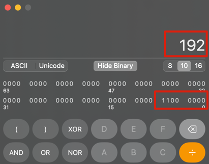

# CIDR and IP Ranges

    255.255.255.255
    2^8 bits  . 2^8 bits  . 2^8 bits  . 2^8 bits
    1111 1111 . 1111 1111 . 1111 1111 . 1111 1111

    0.0.0.1
    0000 0000 . 0000 0000 . 0000 0000 . 0000 0001
    
    
    192.168.0.0
    1100 0000 . 1010 1000 . 0000 0000 . 0000 0001

Using calculator

## Subnet Mask
A subnet mask tells you:
- Which part of an IP address is the network (fixed/shared)
- And which part is for hosts (unique per device)
- A subnet mask defines the boundary between network and host parts of an IP.

## Classful IP address

- Class A supported 16,777,214 hosts
- Class B supported 65,534 hosts
- Class C supported 254 hosts

## CIDR - Classless Inter-Domain Routing
CIDR has more flexibility in assigning IP addresses
Formula `base_IP_address / prefix_length (or subnet mask)`

example:

    0.0.0.0/8           <8 reserved>.0.0.0                                                  0.0.0.0 - 0.255.255.255
    0.0.0.0/12          <8 reserved>.<4 reserved + 4 AVAIL>.0.0                             0.0.0.0 - 0.15.255.255
    0.0.0.0/16          <8 reserved>.<8 reserved>.0.0                                       0.0.0.0 - 0.0.255.255
    0.0.0.0/30          <8 reserved>.<8 reserved>.<8 reserved>.<6 reserved + 2 AVAIL>       0.0.0.0 - 0.0.0.3
    

    CIDR Range          IP Range
    0.0.0.0/16          0.0.0.0 - 0.0.255.255
    10.10.0.0/16        10.10.0.0 - 10.10.255.255
    192.168.0.0/16      192.168.0.0 - 192.168.255.255
    255.255.0.0/16      255.255.0.0 - 255.255.255.255
    192.168.0.0/17      192.168.0.0 - 192.168.127.255

| CIDR Block | IP Range (Network - Broadcast) | Subnet Mask     | IP Quantity |
|------------|-------------------------------|------------------|-------------|
| 0.0.0.0/32 | 0.0.0.0 - 0.0.0.0              | 255.255.255.255  | 1           |
| 0.0.0.0/31 | 0.0.0.0 - 0.0.0.1              | 255.255.255.254  | 2           |
| 0.0.0.0/30 | 0.0.0.0 - 0.0.0.3              | 255.255.255.252  | 4           |
| 0.0.0.0/29 | 0.0.0.0 - 0.0.0.7              | 255.255.255.248  | 8           |
| 0.0.0.0/28 | 0.0.0.0 - 0.0.0.15             | 255.255.255.240  | 16          |
| 0.0.0.0/27 | 0.0.0.0 - 0.0.0.31             | 255.255.255.224  | 32          |
| 0.0.0.0/26 | 0.0.0.0 - 0.0.0.63             | 255.255.255.192  | 64          |
| 0.0.0.0/25 | 0.0.0.0 - 0.0.0.127            | 255.255.255.128  | 128         |
| 0.0.0.0/24 | 0.0.0.0 - 0.0.0.255            | 255.255.255.0    | 256         |
| 0.0.0.0/23 | 0.0.0.0 - 0.0.1.255            | 255.255.254.0    | 512         |
| 0.0.0.0/22 | 0.0.0.0 - 0.0.3.255            | 255.255.252.0    | 1024        |
| 0.0.0.0/21 | 0.0.0.0 - 0.0.7.255            | 255.255.248.0    | 2048        |
| 0.0.0.0/20 | 0.0.0.0 - 0.0.15.255           | 255.255.240.0    | 4096        |
| 0.0.0.0/19 | 0.0.0.0 - 0.0.31.255           | 255.255.224.0    | 8192        |
| 0.0.0.0/18 | 0.0.0.0 - 0.0.63.255           | 255.255.192.0    | 16384       |
| 0.0.0.0/17 | 0.0.0.0 - 0.0.127.255          | 255.255.128.0    | 32768       |
| 0.0.0.0/16 | 0.0.0.0 - 0.0.255.255          | 255.255.0.0      | 65536       |
| 0.0.0.0/15 | 0.0.0.0 - 0.1.255.255          | 255.254.0.0      | 131072      |
| 0.0.0.0/14 | 0.0.0.0 - 0.3.255.255          | 255.252.0.0      | 262144      |
| 0.0.0.0/13 | 0.0.0.0 - 0.7.255.255          | 255.248.0.0      | 524288      |
| 0.0.0.0/12 | 0.0.0.0 - 0.15.255.255         | 255.240.0.0      | 1048576     |
| 0.0.0.0/11 | 0.0.0.0 - 0.31.255.255         | 255.224.0.0      | 2097152     |
| 0.0.0.0/10 | 0.0.0.0 - 0.63.255.255         | 255.192.0.0      | 4194304     |
| 0.0.0.0/9  | 0.0.0.0 - 0.127.255.255        | 255.128.0.0      | 8388608     |
| 0.0.0.0/8  | 0.0.0.0 - 0.255.255.255        | 255.0.0.0        | 16777216    |
| 0.0.0.0/7  | 0.0.0.0 - 1.255.255.255        | 254.0.0.0        | 33554432    |
| 0.0.0.0/6  | 0.0.0.0 - 3.255.255.255        | 252.0.0.0        | 67108864    |
| 0.0.0.0/5  | 0.0.0.0 - 7.255.255.255        | 248.0.0.0        | 134217728   |
| 0.0.0.0/4  | 0.0.0.0 - 15.255.255.255       | 240.0.0.0        | 268435456   |
| 0.0.0.0/3  | 0.0.0.0 - 31.255.255.255       | 224.0.0.0        | 536870912   |
| 0.0.0.0/2  | 0.0.0.0 - 63.255.255.255       | 192.0.0.0        | 1073741824  |
| 0.0.0.0/1  | 0.0.0.0 - 127.255.255.255      | 128.0.0.0        | 2147483648  |
| 0.0.0.0/0  | 0.0.0.0 - 255.255.255.255      | 0.0.0.0          | 4294967296  |
